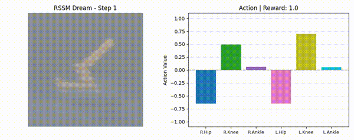
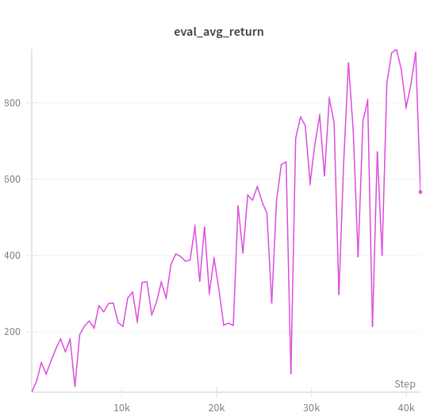
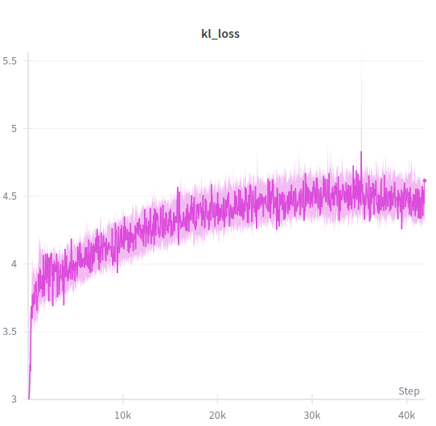
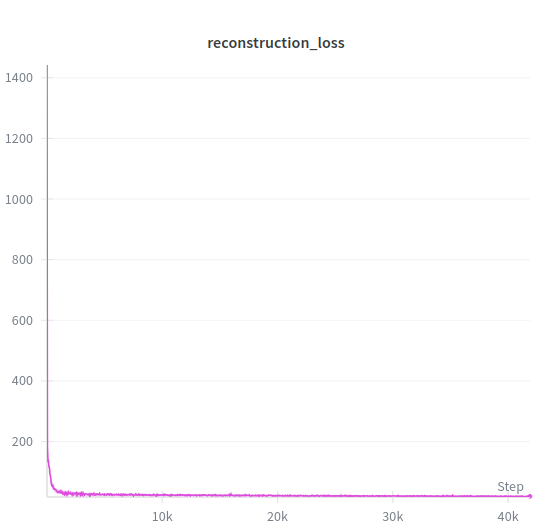
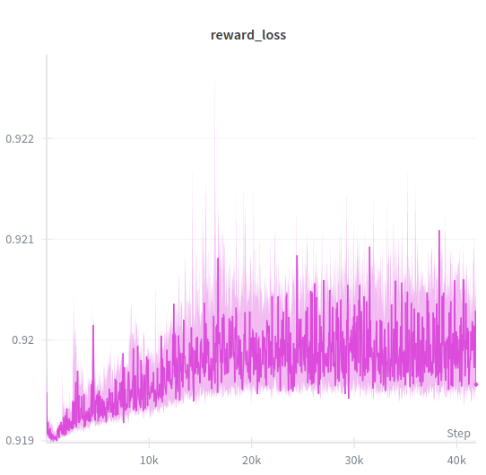

# PlaNet

My re-implementation of the paper 'Learning Latent Dynamics for Planning from Pixels'




To train the model, simply run

```
python training.py
```

To visualize actions using the pretrained model saved in checkpoints as 'best_model.pth', run the following command:

```
python visualize_actions.py --checkpoint best_model.pth --max-steps 1000 --output-dir ./visualizations
```

## Evaluation

The best performing model achieve a reward of 940.5 after roughly 40k epochs. Please note that while the average return evaluations appear to change drastic from test to test, this is likely due to the fact that I did not extensively compute the returns computed from each model opting for only 1 episode of evaluation. This was largely due to the limited compute resources I had. If you, or someone you know, would be willing to provide compute resources to support my work, please reach out to me on X @pat_zzza!



## Losses

Scaling losses was the most difficult part of this project. Using MSE on the reward leads to substandard performance likely due to the fact that the reconstruction loss is so large. Therefore, I opted to use negative log likelihood loss on the reward and scaled its reward by a factor of 10 as was present in the original deepmind implenentation where I had ``total_loss = reconstruction_loss + 10 * reward_loss + kl_loss``.

I plotted my losses below for anyone conducting training on their own.







## GPU Specs

I trained this model on an L4 GPU using Google's Compute Engine. Training for 40k epochs took approximately 7~ hours
